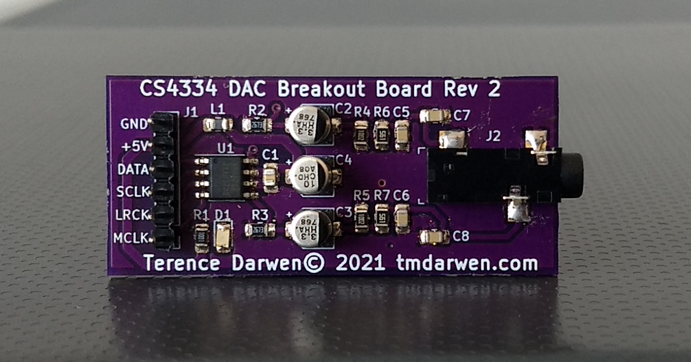
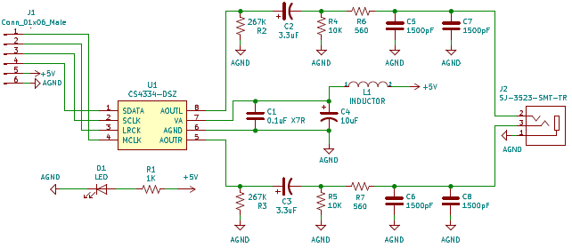
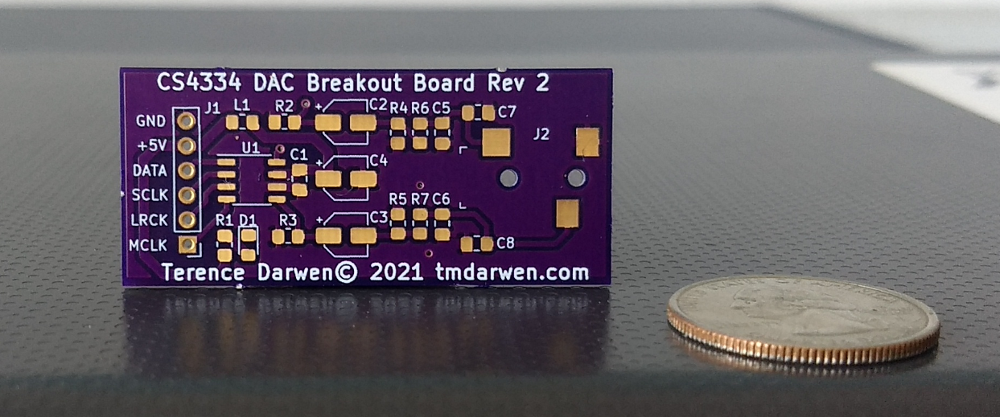
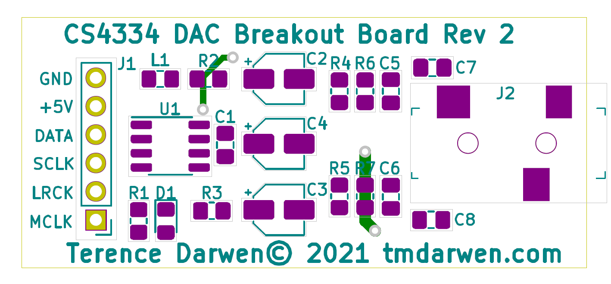
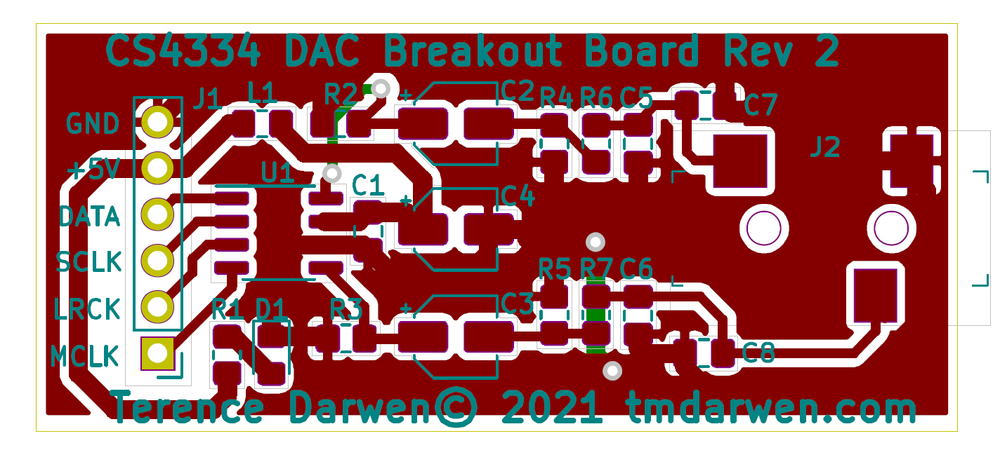

CS4334 Audio DAC Breakout Board
===============================

A repo for the KiCad files for my [CS4334](https://www.cirrus.com/products/cs4334-35-38-39/) Audio DAC breakout board.  More info about this project can be found on my website [here](https://tmdarwen.com/latest/creating-an-audio-dac-breakout-board).  After manufacturing and assembling this breakout board I was able to send it audio (I2S) using an STM32F411 development board running software I wrote that can be found [here](https://github.com/tmdarwen/STM32/tree/master/STM32F411/OnboardAudioOutput).

 
**Schematic**

 
**Bill of Materials**

| Command | Description |
| --- | --- |
| git status | List all new or modified files |
| git diff | Show file differences that haven't been staged |

| Schematic Part| Manufacturer   | Part              | Description                             |
| --------------| ---------------|-------------------------------------------------------------|
| C1            | AVX Corporation| 08055C104K4T4A    | 0.1uF X7R Surface Mount Capacitor       |
| C2,C3         | Panasonic      | EEE-HA1H3R3R      | 3.3uF Surface Mount Capacitor           |
| C4,           | Panasonic      | EEE-HD1C100AR     | 10uF Surface Mount Capacitor            |
| C5,C6,C7,C8   | Panasonic      | CC0805KRX7R0BB152 | 1500pF Surface Mount Capacitor          |
| D1            | Yageo          | LG R971-KN-1      | Surface Mount Green LED                 |
| J1            | N/A            | N/A               | 6 Male Header Pins                      |
| J2            | CUI Devices    | CP-3523SJCT-ND    | 3.5mm Stereo Audio Jack                 |
| L1            | Taiyo Yudens   | FBMH2012HM121-T   | 120 Ohms @ 100 MHz Ferrite Bead Inductor|
| R1            | Yageo          | YAG2328CT-NDD     | 1K Surface Mount Resistor               |
| R2,R3         | Yageo          | RT0805DRE07267KL  | 267K Surface Mount Resistor             |
| R4,R5         | Yageo          | AC0805FR-0710KL   | 10K Surface Mount Resistor              |
| R6,R7         | Yageo          | AC0805JR-07560RL  | 560 Surface Mount Resistor              |
| U1            | Cirrus Logic   | CS4334-DSZ        | 16 Bit Stereo Audio DAC                 |

 
**Additional Pics**
The manufactured board unassembled:

The PCB layout I made in KiCad without the front copper:

The PCB layout with the front copper:

 
**Licensing**

The MIT License applies to this software and its supporting documentation:

*Copyright (c) 2021 Terence M. Darwen - tmdarwen.com*

*Permission is hereby granted, free of charge, to any person obtaining a copy of
this software and associated documentation files (the "Software"), to deal in
the Software without restriction, including without limitation the rights to
use, copy, modify, merge, publish, distribute, sublicense, and/or sell copies of
the Software, and to permit persons to whom the Software is furnished to do so,
subject to the following conditions:*

*The above copyright notice and this permission notice shall be included in all
copies or substantial portions of the Software.*

*THE SOFTWARE IS PROVIDED "AS IS", WITHOUT WARRANTY OF ANY KIND, EXPRESS OR
IMPLIED, INCLUDING BUT NOT LIMITED TO THE WARRANTIES OF MERCHANTABILITY, FITNESS
FOR A PARTICULAR PURPOSE AND NONINFRINGEMENT. IN NO EVENT SHALL THE AUTHORS OR
COPYRIGHT HOLDERS BE LIABLE FOR ANY CLAIM, DAMAGES OR OTHER LIABILITY, WHETHER
IN AN ACTION OF CONTRACT, TORT OR OTHERWISE, ARISING FROM, OUT OF OR IN
CONNECTION WITH THE SOFTWARE OR THE USE OR OTHER DEALINGS IN THE SOFTWARE.*
