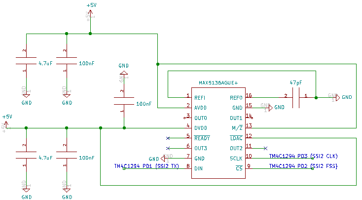
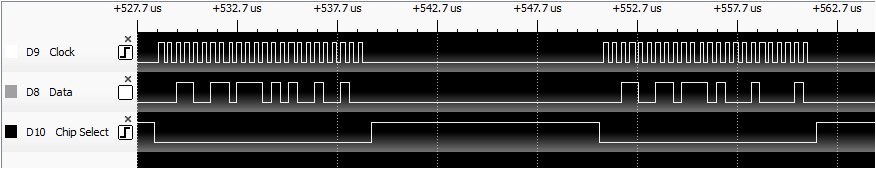

Tiva TM4C1294 MAX5136 16 Bit Stereo Audio DAC Example
=====================================================

This Texas Instruments Code Composer Studio project shows how to use [SPI](https://en.wikipedia.org/wiki/Serial_Peripheral_Interface) communication with a 16 bit stereo audio [DAC](https://en.wikipedia.org/wiki/Digital-to-analog_converter).
 

**Hardware**

-   [Texas Instruments EK-TM4C1294XL Evaluation Board](https://www.ti.com/tool/EK-TM4C1294XL)

-   [Maxim MAX5136](https://datasheets.maximintegrated.com/en/ds/MAX5134-MAX5137.pdf) (16 Bit Stereo Audio DAC)

-   A few capacitors (see schematic below)

-   [TRS stereo audio jack](https://en.wikipedia.org/wiki/Phone_connector_(audio))

-   Typical breadboard

-   Some jumpers

 

**Software**

-   [Texas Instruments Code Composer Studio](https://www.ti.com/tool/CCSTUDIO)

-   [Texas Instruments TivaWare Library](https://www.ti.com/tool/SW-TM4C)

 

**Schematic**

 

**Audio Sample**

The short sample of audio being played back by the Tiva board is identical to that in [this wave file](Documentation/AudioSample.wav)

 

**Data Communication Example**

Here's an example of the data being transferred to the DAC when viewing with a logic analyzer:

 

**Licensing**

The MIT License applies to this software and its supporting documentation:

*Copyright (c) 2021 Terence M. Darwen - tmdarwen.com*

*Permission is hereby granted, free of charge, to any person obtaining a copy of
this software and associated documentation files (the "Software"), to deal in
the Software without restriction, including without limitation the rights to
use, copy, modify, merge, publish, distribute, sublicense, and/or sell copies of
the Software, and to permit persons to whom the Software is furnished to do so,
subject to the following conditions:*

*The above copyright notice and this permission notice shall be included in all
copies or substantial portions of the Software.*

*THE SOFTWARE IS PROVIDED "AS IS", WITHOUT WARRANTY OF ANY KIND, EXPRESS OR
IMPLIED, INCLUDING BUT NOT LIMITED TO THE WARRANTIES OF MERCHANTABILITY, FITNESS
FOR A PARTICULAR PURPOSE AND NONINFRINGEMENT. IN NO EVENT SHALL THE AUTHORS OR
COPYRIGHT HOLDERS BE LIABLE FOR ANY CLAIM, DAMAGES OR OTHER LIABILITY, WHETHER
IN AN ACTION OF CONTRACT, TORT OR OTHERWISE, ARISING FROM, OUT OF OR IN
CONNECTION WITH THE SOFTWARE OR THE USE OR OTHER DEALINGS IN THE SOFTWARE.*
