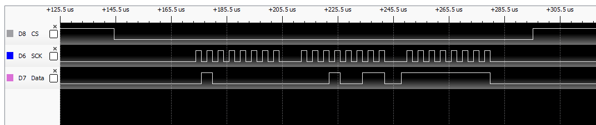

Tiva TM4C1294 SPI Example
=========================

This Texas Instruments Code Composer Studio project shows how to use [SPI](https://en.wikipedia.org/wiki/Serial_Peripheral_Interface) communication with an IO Expander.  

 

**Hardware**

-   [Texas Instruments EK-TM4C1294XL Evaluation Board](https://www.ti.com/tool/EK-TM4C1294XL)

-   [Microchip MCP23S17](https://www.microchip.com/wwwproducts/en/MCP23S17) (IO Expander)

-   Typical through-hole LEDs

-   480K through-hole resistors

-   Typical breadboard

-   Some jumpers

 

**Software**

-   [Texas Instruments Code Composer Studio](https://www.ti.com/tool/CCSTUDIO)

-   [Texas Instruments TivaWare Library](https://www.ti.com/tool/SW-TM4C)

 

**Schematic**

 

**Data Communication Example**

Note the Microchip MCP23S17 requires the chip select (aka CS, aka SS) to remain low the entire duration of the transfer of all bytes (i.e. the entire frame).  See the MCP23S17 datasheet for more info and the comments in code for how this is handled.

 

**Licensing**

The MIT License applies to this software and its supporting documentation:

*Copyright (c) 2020 Terence M. Darwen - tmdarwen.com*

*Permission is hereby granted, free of charge, to any person obtaining a copy of
this software and associated documentation files (the "Software"), to deal in
the Software without restriction, including without limitation the rights to
use, copy, modify, merge, publish, distribute, sublicense, and/or sell copies of
the Software, and to permit persons to whom the Software is furnished to do so,
subject to the following conditions:*

*The above copyright notice and this permission notice shall be included in all
copies or substantial portions of the Software.*

*THE SOFTWARE IS PROVIDED "AS IS", WITHOUT WARRANTY OF ANY KIND, EXPRESS OR
IMPLIED, INCLUDING BUT NOT LIMITED TO THE WARRANTIES OF MERCHANTABILITY, FITNESS
FOR A PARTICULAR PURPOSE AND NONINFRINGEMENT. IN NO EVENT SHALL THE AUTHORS OR
COPYRIGHT HOLDERS BE LIABLE FOR ANY CLAIM, DAMAGES OR OTHER LIABILITY, WHETHER
IN AN ACTION OF CONTRACT, TORT OR OTHERWISE, ARISING FROM, OUT OF OR IN
CONNECTION WITH THE SOFTWARE OR THE USE OR OTHER DEALINGS IN THE SOFTWARE.*
